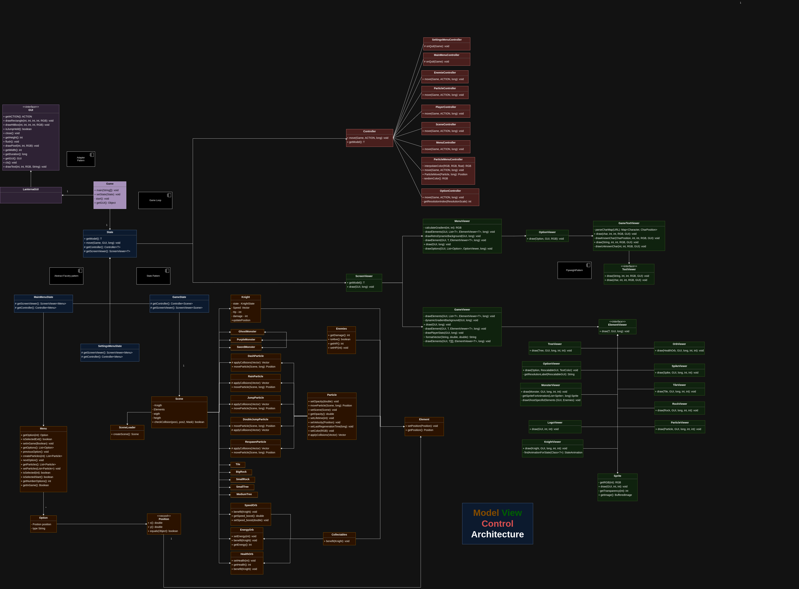
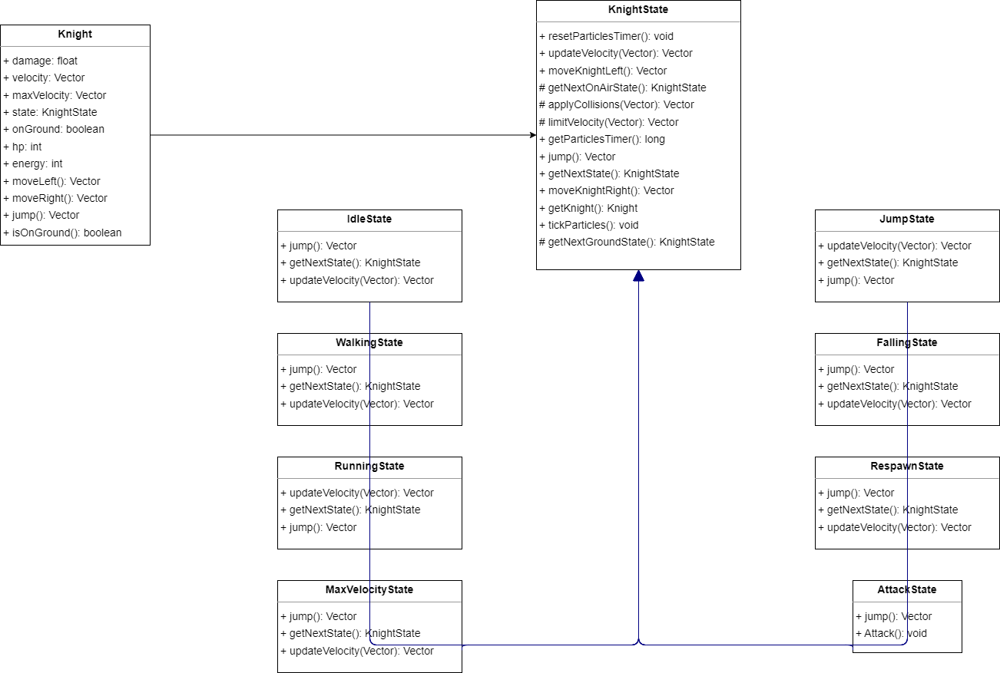

# Soul Knight

## Project Description
**Soul Knight** is a game inspired by platformer games like *Hollow Knight*, but with some distinct ideas. In this world, everything is trying to kill you, and you are a warrior of great prestige and renown. Your goal is to survive and traverse this underground world to escape.

## Implemented Features
- **Menu** - The game has a Menu that has
  the following options:
- **Start** - Starts a new game.
- **Exit** - Exits the game.
- **Player** - The player has the following characteristics:
- **HP (Health Points)**: The player's life is represented by an integer. If it reaches zero, the player dies.
- **Energy**: The player accumulates energy to perform a special attack.
- **Movement**: The player can move (using the arrow keys) at variable speeds, jump and DoubleJump. The player's movement animations change according to the player's current action and speed.
- **Collectables** - Collectables are "Orbs" that will give the player a "PowerUp" and enhance his abilities. They are scattered around the map and the player can pick them up.
- **Particles** - Particles accompany a lot of actions, it is like a system within the game. They are present in the Menu, giving a kind of "Visual Flair", and also in a lot of
  player animations, such as Jumping and dying. There exists another system that simulates a Fluid's particles, so they don't disappear into thin air and actually stay around the map
  just like rain would. Death, Dash, Jump, DoubleJump and Menu have Particles implemented.
- **Game Physics** - We have applied collisions to all the elements in the game.
- **Scene Loader** - Class to load levels of written text files with specific characters, allowing to generate tiles and other elements for the different scenes/levels and allows for simple layout editions.
- **Varied Experiences** - Various levels to provide a more diversified experience.
- **Interface** - Display of important player stats and information (e.g., health, energy).
- **Advanced Movement** - Ability to dash, helping the player evade strikes and move quicker.
- **Enemies** - Logic and hitboxes for each enemy type.
- **Damage Taken** - When the player gets hit by one of the monsters his health goes down.

## CONTROLS

`->`: Moves the player to the right.

`<-`: Moves the player to the left.

`SPACE`: Makes the player jump.

`q`: Kills the player

`ESC`: Press ESC to quit or return to the main menu.

`ENTER`: Press ENTER to select the desired options in the menu.

## General Structure

  

## Design

### Code Structure
#### Problem in Context

To ensure that our software has the proper structural design, we relied heavily on the SOLID design principles. The code must then be neatly modularized and divided to follow the Single Responsibility Principle.

We will manage the several elements of the game independently, like input, game logic and rendering.

#### The Pattern
The pattern we found was the most appropriate for this project was the Model | View | Controler Pattern, as it is widely used in applications that feature a Graphical User Interface (GUI). This pattern mandates that the code should be segmented in 3 different sections:
Model - general game logic;
View - rendering, and visual related tasks;
Controller - interpret user inputs.

#### Implementation
The source code of the application has been divided into folders with names such as "model", "view" and "controller".
The following diagram illustrates this structure:

  

#### Consequences
This design patters ensures the code is organized and well separated. This reduces the number of conflicts, as we are only changing snippets of code at a time, making the process of developing softare more convenient.

### Game Loop
#### Problem in Context

Our main point of concern during the first stages of development was to create a simple program that ran. At this point, we were not taking into account user input yet.
However, as the game advanced, we needed to ensure that we could receive and process user input, as well as present images of screen at a fixed speed.  
As these tasks' speed can vary depending on the users's systems,there was a lot of emphasis on making it possible to standardize the speed at which the game is executed by users' computers.

#### The Pattern
To reach these targets, we decided to implement a Game Loop, which is a while loop that keeps running until it is time to exit the game.
We set a target for the amount of frames to be displayed in a second (in this case 30). The idea behind this is to calculate the time that needs to be waited before proceeding to the next iteration of the loop (and generating another frame).

#### Implementation:
Our implementation of a Game Loop can be found in the Game Class, which is the entry point for our application.

  

#### Consequences
The positive consequences of choosing this design pattern are, as mentioned above, smooth and similar experiences across various user systems, as well as giving us, the developers, the capability of configuring the speed of execution of the game, to make the gameplay more relaxed or more fast paced.

(adicionar cena relacionada com "On the other hand, some linters may flag the command to make the main thread sleep as a bad practice since it is used inside a loop and relies on busy waiting. However, this is considered normal and is expected to happen when running a game.")

### Multiplicity of Game States
#### Problem in Context

The application needs to know whether it is in the menu or running the game.
While this could be done using a boolean variable and conditional logic to adjust the application's behavior, this method becomes impractical as the application grows.
Adding new screens would require modifying the already existing logic, which goes against the Open/Closed Principle from the SOLID Design Principles.
Moreover, this method would lead to unrefined code, filled with large conditional blocks, as it would constantly check the current screen to determine the correct actions. This not only creates messy code, but also goes against the Single Responsibility Principle, something we wished to avoid.

#### The Pattern
To avoid all of these issues, we implemented the State Pattern.
First, we created an abstract State Class. The subclasses that extend this class are the different possible states that the application can run into. Each subclass of the State Class has an implementation of the logic behind a state, being responsible for its respective transitions to other states, based on user inputs.
This design pattern massively improves code scalability, as you can add functionality to a given screen without needing to change the operation of the other screens.

#### Implementation
Our implementation of a State Pattern can be found in the HollowKnight.state package. It includes the abstract State class, as well its derived classes.

  

#### Consequences
The State Design Pattern allows for increased modularity and ease of expandability. Also, the need for very long conditional statements is abolished. Finally, each screen is independent from the others, which makes our code compliant with the SOLID design principles.

### The Behavior of the Game States
#### Problem in Context

As previously discussed, we are using the State Design pattern to keep track of the game state. As game states are relatively similar objects, we can use the Abstract Factory Design Pattern to create a baseline and extend it in other (concrete) classes.

#### The Pattern
The Abstract Factory relies on creating related objects. Each variant of the factory overrides methods, thus creating slightly different objects.

#### Implementation
In our project, we created an abstract State class, which was extended by GameState, MainMenuState and SettingsMenuState. These classes can be found in HollowKnight.state.

#### Consequences
Using polymorphism, we can avoid interacting with state logic via long conditional statements, which leads to a major simplification of the development process.
This way of coding is also less prone to result in bugs and unexpected behaviour.

### Simplification of Lanterna's interface
#### Problem in Context

In order to make the development of the game faster, we needed a convenient way to draw characters to the terminal screen and receive user inputs using Lanterna.
In order to interact with Lanterna's API, we would need chunky code, that would need to be written several times throughout the project.

#### The Pattern
As the above mentioned problem would mean that we would have code with very poor modularity, we decided to use the Adapter Pattern to solve these issues, instead of naively duplicating code.
By creating an Adapter, and interacting with it, instead of interacting directly with Lanterna's API, we simplified our code, removing the need for duplication of code snippets.

#### Implementation
The classes that serve as our implementation of an Adapter pattern can be found in HollowKnight.gui.

  

#### Consequences
Using the Adapter Pattern makes the code easier to write, more modular, and generally, prettier looking.
The fact that the classes that use this adapter do not have to be concerned about the exact operations that are being done with Lanterna, also makes this part of our code compliant with SOLID's Single Responsability Principle.

### Player States
#### Problem in Context

Depending on what the "Knight" is doing, we want to restrict some actions. For example, we don't want to allow the player to dash right immediately dashing, as it would go against our plans for game mechanics.
Moreover, thanks to the particle system we implemented, determining which state the player is in would be crucial, so we can display the right animations at the right time.
If we opted to store the state of the player in variables (flags), we would be going against SOLID's Open/Closed Principle, as increasing the number of states would likely require major code changes in order to maintain functionality in other states.

#### The Pattern
The State Pattern allowed us to overcome all these hurdles. We started by creating an abstract class, that was our base player state. All of the concrete states that the player could go through extended this abstract state class. The specific details of each state are only implemented in the child classes.

#### Implementation
The parent class KnightState and its child classes can be found in HollowKnight.model.game.elements.Knight. The child classes that implement the different states the knight can alternate between, AfterDashState.java, IdleState.java, MaxVelocityState.java, DamagedState.java, JumpState.java, RespawnState.java, DashState.java, RunningState.java, FallingState.java and      WalkingState.java.
Each of these states implements independently methods such as jump(), dash(), updateVelocity(), among others.

  

#### Consequences
The code is much more organised and intuitive to read. The state pattern allows for a precise player's behaviour control, without needing to write overly messy code. Using this Design Pattern, it is easier to expand the game, implementing more states as needed.

### Sprite Loading
#### Problem in Context
To reduce memory consumption, it would be beneficial to store a sprite only once, even if the sprite needs to be presented, instead of loading the memory with repeated information.
Unifying the access to sprites would also be helpful for mocking in unit testing.

#### The Pattern
In order to achieve these goals, we used the Flyweight Pattern. This Design Pattern relies on the usage of a hash map to check if the sprite has already been loaded.

#### Implementation
Our implementation of the Flyweight Pattern can be found on the GameSpriteLoader class and on all of the implementations of the interface ElementViewer.

  

#### Consequences
This Design Pattern helped us make our game more efficient, as it now demands less memory to run. Also, unit testing was simplified with this change.
